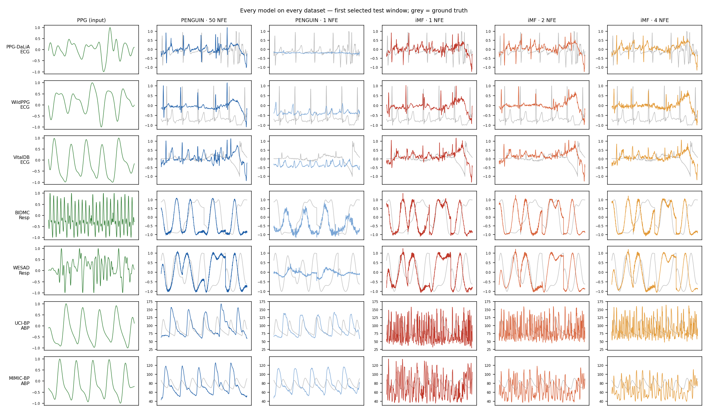

# PPG → ECG 생성 연구 진행 보고

**작성일** 2026-09-17 · **대상 논문** PENGUIN (ICASSP 2026, OT-CFM + Flow-SSM/S5) · **코드** github.com/parag0hz/ppg2ecg

---

## 1. 연구 주제

PPG(광혈류측정) 신호에서 ECG를 생성하는 모델의 **추론 비용**을 줄이는 방법 연구입니다.

기준 논문 PENGUIN은 flow matching 기반이라 샘플 하나를 만들 때 신경망을 **50번(NFE 50)** 호출합니다.
스텝 수를 1로 줄이면 성능이 무너지는데, 그 원인이 수식으로 설명됩니다.

- flow matching은 t=0에서 노이즈와 ECG가 무관하므로 **조건부 평균 방향**을 학습합니다.
- 한 번에 점프하면 `x₁ = x₀ + v = E[x₁|PPG]`가 되어 노이즈가 소거되고, 출력이 **평균 파형**이 됩니다.
- R 피크 위치가 약 ±50 ms 불확실하므로, 평균을 내면 QRS가 뭉개집니다. 본 연구에서 측정한 결과 1-NFE 출력은
  **QRS 에너지의 3%만** 남았습니다.

제안 방향은 **Improved MeanFlow(iMF)** 적용입니다. iMF는 순간 속도가 아니라 **구간 평균 속도**를 학습하므로,
한 번의 점프로도 그 노이즈에 대응하는 구체적 샘플에 도달합니다.

---

## 2. 지금까지의 실험 결과 (요약)

모든 단계는 **사전등록 → 실행 → 보고** 순서로 진행했고, 사전등록 문서는 결과가 나오기 전에 커밋·푸시했습니다.
리포트 50건, 자동 테스트 778개 통과, 기준 논문 코드는 전 구간 무수정입니다.

### 2.1 기준 논문 재현 (U1)

upstream 코드를 출하 상태 그대로 실행한 결과, 8개 칸 중 **6칸 재현 / 1칸 부분 / 1칸 실패**입니다.

| 데이터셋 | 지표 | 재현값 | 논문값 |
|---|---|---|---|
| PPG-DaLiA | HR 오차 | 16.35 | 15.64 bpm |
| WESAD | 호흡수 오차 | 4.39 | 4.45 bpm |
| BIDMC | 호흡수 오차 | 3.48 | 2.98 bpm |
| MIMIC-BP | SBP / DBP | 14.99 / 9.21 | 17.43 / 11.34 mmHg |
| UCI-BP | SBP | 19.99 | 12.61 mmHg (부분) |
| WildPPG | HR 오차 | 31.01 | 12.97 bpm (실패) |

부수적으로 두 가지를 발견했습니다.
- **UCI-BP 데이터 누수:** upstream 로더가 8명 중 4명을 바이트 단위로 복제합니다. 기본 split에서 test 피험자의
  쌍둥이가 train에 포함되어 있었습니다.
- **WildPPG 실패 원인:** upstream의 early stopping이 **1-epoch 모델**을 최종 선택합니다.

### 2.2 iMF vs PENGUIN, 계산량을 맞춘 비교 (U2 → U3)

동일 백본·데이터·split·시드로 **정확히 14,000 step**씩 학습해 비교했습니다.

- **같은 NFE에서는 iMF가 압도적입니다.** NFE 1에서 DaLiA HR 오차가 PENGUIN 33.9 → iMF 13.4 bpm,
  WildPPG는 21.8 → 14.9 bpm입니다.
- **PENGUIN 50 NFE 대비로는 비열등이 5개 중 1개(WildPPG)뿐입니다.** 자체 검증(U3)에서 체크포인트 선택
  비대칭과 판정 게이트 결함 2개를 찾아 수정한 뒤의 결과이며, 수정 전에는 3/5로 과대평가되어 있었습니다.
- ABP(혈압)에서 iMF가 약 2배 나쁜 원인은 **원시 mmHg 스케일**임을 별도 실험(A8)에서 확인했습니다.
  전역 정규화 하나로 RMSE 32.3 → 18.2 mmHg가 됩니다.

### 2.3 평가 지표 자체의 문제 (D2, N1, S1)

이 분야 지표가 방법의 우열을 가리지 못한다는 점을 확인했습니다. 논문에 반드시 포함할 내용입니다.

- **RMSE는 반정보적입니다.** 아무 정보도 쓰지 않는 상수 예측기가 5개 corpus 전부에서 최저 RMSE를 기록합니다.
- **HR 오차와 F1은 대부분 박동 수만 맞아도 얻어집니다.** 학습 없이 검출기 + QRS 템플릿을 찍는 방법이
  `f1_excess` +0.487로, 최고 학습 모델(+0.358)과 동결 생성기(+0.318)를 모두 이깁니다.
- **호흡수 오차는 위상을 보지 않습니다.** 파형 상관이 0에 가까워도 정상 점수가 나옵니다.

### 2.4 소규모 검증 (P1, 2026-09-17)

싼 샘플을 여러 개 만들어 **HR을 중앙값으로 모으는** 방법을 검증 피험자에서 시험했습니다.

- WildPPG: iMF 1 NFE 샘플 16개(총 16 NFE) → HR 오차 **8.66 bpm**. PENGUIN 50 NFE 단일 샘플 14.15 bpm보다
  **39% 낮고**, 계산량은 3분의 1입니다.
- DaLiA: HR은 19% 개선됐지만, 샘플 간 비트 위치가 일치하지 않아 비트 단위 합의는 실패했습니다.
- 사전등록 기준(두 데이터셋 모두 통과)으로는 **NO-GO**입니다. 원인까지 문서화했습니다.

---

## 3. 대규모 검증 실험 (V1, VitalDB) — 오늘 완료

기존 데이터셋의 가장 큰 약점은 **test 피험자가 1~2명**이라는 점이었습니다. 이를 해소하기 위해 수술실 데이터
VitalDB로 규모를 키웠습니다. 두 가설은 결과가 나오기 전에 사전등록했습니다.

| 항목 | 값 |
|---|---|
| 사용 가능 케이스 | 6,043건 = **환자 5,782명**, 총 18,308시간 |
| split | **환자 단위** (train 4,337 / val 289 / **test 1,156명**) |
| 창 | 4초 · 128 Hz, train 288,400 / test 19,543 |
| 학습 | PENGUIN·iMF 각 14,000 step, seed 42 (빠른 1차 검증), 학습 시간 PENGUIN 65분 / iMF 약 2시간 |

### 결과 (환자 단위 bootstrap 95% CI)

| 방법 | NFE/창 | 창당 시간 | HR 오차 (bpm) | R-peak F1 | FD |
|---|---|---|---|---|---|
| PENGUIN | 50 | 28.7 ms | 9.69 | 0.645 | 4.30 |
| PENGUIN | 1 | 0.56 ms | 8.47 | **0.756** | 33.5 |
| iMF | 1 | 0.57 ms | 10.14 | 0.674 | 4.13 |
| iMF | 4 | 2.3 ms | 8.97 | 0.676 | **3.37** |
| PENGUIN 50, 샘플 4개 HR 합의 | 200 | — | 7.55 | — | — |
| **iMF 1, 샘플 16개 HR 합의** | 16 | — | **6.67** | — | — |
| **iMF 2, 샘플 16개 HR 합의** | 32 | — | **6.18** | — | — |
| PPG 피크만 세기 (모델 없음) | 0 | — | 9.06 | — | — |

- **H1 비열등: 통과 (NFE 1부터).** iMF 1 NFE − PENGUIN 50 NFE = HR +0.45 bpm (CI 0.35~0.56, 마진 1.0),
  F1 +0.030. 추론 속도는 **약 50배** 빠릅니다.
- **H2 합의 우위: 통과.** iMF 1 NFE 샘플 16개의 HR 합의가 PENGUIN 50 NFE보다 **3.01 bpm 낮음**
  (CI −3.13 ~ −2.90). 계산량은 16 vs 50 NFE입니다. 같은 합의 방식을 PENGUIN 50 NFE에 적용(샘플 4개,
  200 NFE)해도 7.55로, iMF 합의(6.67, 16 NFE)보다 나쁩니다.

### 함께 보고해야 할 한계
- **VitalDB에서는 PENGUIN 1 NFE가 HR·F1에서 가장 좋습니다.** 마취 중 리듬이 규칙적이라, 평균으로 뭉개진
  파형도 박동 간격만 맞으면 점수를 받습니다. 대신 **FD(파형 분포)는 33.5로 크게 나빠** 파형 품질 문제가 드러납니다.
  따라서 "iMF가 few-step PENGUIN보다 낫다"는 주장은 이 데이터에서는 **FD 기준으로만** 성립합니다.
- **단일 샘플 모델의 HR은 PPG 피크만 센 방법(9.06)과 비슷합니다.** 합의 방식만 이 기준을 확실히 이깁니다.
- PENGUIN 2 NFE(Heun 1스텝)는 발산합니다 (HR 30.0).
- H2 가설은 P1 검증 데이터에서 세운 것이고, 이번에 **처음 보는 환자**로 확인했습니다. **seed는 1개**입니다.

### 정성 비교 (같은 test 창, 규칙으로 선택, 회색 = 정답)

- PENGUIN 1 NFE는 QRS가 뭉개진 평평한 파형, iMF는 1 NFE에서도 QRS가 살아 있습니다.
- 호흡은 두 방법 모두 위상이 어긋나고, 혈압은 iMF가 진동하는 파형을 냅니다(원시 mmHg 스케일 문제, 수정 예정).
- 데이터셋별 상세 그림: `artifacts/qual_model_dataset/qual_<dataset>.png` (7장)

---

## 4. 논문 계획

### 4.1 주장

> 학습이 끝난 PENGUIN을 MeanFlow 목적함수로 이어서 학습하면, **1~4 NFE로 12.5~50배 빠르게** 동작하면서
> 과제 정확도는 유지된다. 싼 샘플을 여러 개 모으면 같은 계산량에서 원본보다 **정확도가 높아진다**.

기여는 세 가지입니다. ① 추론 효율 ② 학습된 모델을 few-step 모델로 바꾸는 절차 ③ 자명한 베이스라인을 포함한
공정한 평가 프로토콜.

### 4.2 실험 구성

| 구분 | 내용 |
|---|---|
| 데이터 | VitalDB (환자 1,156명 test) 주 실험, WildPPG·PPG-DaLiA 보조 (웨어러블 한계 확인) |
| 비교 대상 | PENGUIN 50/4/2/1 NFE, iMF 4/2/1 NFE, **HR 합의(K=16)**, 자명한 베이스라인(상수·템플릿·PPG 피크) |
| 추가 필요 | **다른 few-step 방법 1~2개** (consistency distillation, rectified flow) — 리뷰 방어의 핵심 |
| 통계 | 환자 단위 bootstrap, 비열등 마진 사전등록, seed 3개 (본실험) |
| 보고 | 실제 추론 시간(ms/창), 지표의 한계와 베이스라인 결과를 본문에 명시 |

### 4.3 일정과 투고 목표

| 시기 | 내용 |
|---|---|
| 9/17 (완료) | VitalDB 1차 결과 (seed 1개): 비열등 통과, HR 합의 우위 통과 |
| 9/18 ~ 9/24 | 결과에 따른 방향 확정, seed 3개로 확장, ABP 정규화 반영 |
| 9/25 ~ 10/10 | 다른 few-step 방법 구현 및 비교, 보조 데이터셋 실험 |
| 10/11 ~ 10/24 | 초고 작성 (그림·표는 대부분 확보) |
| 10/27 ~ 11/7 | **투고** |

**목표 저널** (택일)
- **Biomedical Signal Processing and Control** (Elsevier) — 1순위
- **IEEE Sensors Journal** — 2순위
- 결과가 "더 좋음"까지 확보되면 **Computers in Biology and Medicine** (Elsevier) 상향 검토

### 4.4 위험과 대응

| 위험 | 대응 |
|---|---|
| VitalDB 우위가 seed 1개 결과 | seed 3개로 재현 후 투고. 우위가 유지되면 핵심 주장을 **효율 + 합의 샘플링 우위**로 설정 |
| "few-step 모델이 many-step 모델을 1스텝으로 돌린 것보다 나은 건 당연하다" | PENGUIN **50 NFE**와의 비열등, 그리고 **다른 few-step 방법**과의 비교를 반드시 포함 |
| 지표가 방법의 우열을 못 가림 | 자명한 베이스라인을 본문에 넣고 한계를 선제적으로 기술 |
| VitalDB는 마취 환자라 HR 변동이 작음 | 주장 범위를 **수술 중 모니터링**으로 한정, 웨어러블 데이터는 한계로 보고 |

---

## 5. 요약

1. 기준 논문은 재현했고, 그 과정에서 **데이터 누수와 체크포인트 선택 결함**을 발견했습니다.
2. iMF는 **같은 NFE에서는 크게 우수**하지만, 50 NFE 원본 대비로는 아직 비열등 1/5입니다.
3. 이 분야의 **평가 지표가 방법을 구분하지 못한다**는 점을 정량적으로 확인했습니다.
4. **VitalDB 환자 1,156명**에서 iMF 1 NFE가 PENGUIN 50 NFE에 **비열등(50배 빠름)**, HR 합의는 **31% 우위**로 사전등록 판정을 모두 통과했습니다 (seed 1개, 확장 예정).
5. 10월 말~11월 초 **BSPC 투고**를 목표로 합니다.
