# 실험별 시각화 정리

단계 블록 43개(리포트 49개를 묶음)에서 대표 그림 93장을 골랐습니다 (전체 PNG 1,670장, upstream 창별 plot 제외). 부 구성은 [PROGRAM_SUMMARY_ALL_STAGES.md](PROGRAM_SUMMARY_ALL_STAGES.md)와 같습니다.

- VSCode 미리보기(`Ctrl+Shift+V`)에서는 모든 그림이 보입니다. GitHub에서는 경로 옆에 **git** 표시가 있는 그림만 보입니다 (나머지는 `.gitignore` 대상).
- 판정은 각 리포트의 동결 판정 문자열입니다. ORACLE arm은 GT-R leakage가 있는 진단용입니다.
- WildPPG `kjd`/`ssx`: A4 · A5c · A6c · A9 · X0 · X2는 동결 A4 split의 **테스트로 평가**했고, X3-G0부터는 모든 단계에서 로드하지 않았습니다.

## 그림이 없는 단계 (13개)

| 단계 | 판정 | 요약 |
|---|---|---|
| C2 압축 본실험 | 영구 보류 | 15-run · 54 GPU-h 사전등록만 하고 학습하지 않음. |
| M2 구조 가중 손실 (GSW-iMF) | VERDICT D | G1 −3.87%, G2 −14.16% — 둘 다 악화. |
| M3 구조적 엔드포인트 일관성 (SEC-iMF) | VERDICT D | G1 +2.66% (5% 바 미달). 개선이 QRS 바깥(+26.9%)에 몰리고 core 안은 +4.85%뿐. |
| D4 KANFlow 프로토콜 지표표 | 단조 개선 지표 없음 | MAE·RMSE·FD·Micro/Macro-F1·RR-MAE·MAE_HR 산출. NFE를 올려도 단조 개선되는 지표가 없음. |
| U2 계산량 맞춘 paired 비교 (iMF vs OT-CFM) | PARTIAL 3/5 | U3에서 결함 보정 후 NOT SUPPORTED로 정정됨. |
| U3 gate · 선택 민감도 | NOT SUPPORTED 1/5 | 단방향 gate + 동일 14k step 체크포인트면 WildPPG만 생존. |
| N1 검출기 + 템플릿 | NULL DOMINATES | 학습 0의 N-R1 +0.4866 > 최고 학습 arm +0.3582. 균등 격자 N-CONST도 +0.2949. |
| N2 oracle 타이밍에서 비트 형태 | PPG DOES NOT CARRY BEAT SHAPE | 템플릿 +0.9062 vs 회귀기 +0.9057, PPG 기여분 +0.0039. |
| N3 4부위 PPG 융합 | MARGINAL | REG-4가 템플릿 대비 +0.0005 (바의 1/100). |
| N4 타이밍 분산 캘리브레이션 | CALIBRATED | coverage 0.587/0.833/0.902. 단 중심 −15.5 ms 조기, per-beat 정보 +0.03. |
| N5 per-beat 불확실성 예측 | PREDICTABLE | sharpness Spearman +0.475, shuffle에서 +0.002로 붕괴. |
| N6 생성 샘플러 안의 불확실성 | DOES NOT PRESERVE · NFE 1 | NFE 1 샘플 SD 7.1 ms (실제 잔차 SD 53.7). 사후 스윕: NFE 2에서 sharpness +0.491 회복. |
| N7 캘리브레이션된 marked posterior | NOT SUPPORTED 3/12 | sharpness +0.445 ± 0.021로 복제(유일한 복제 양성), coverage는 3/12만 통과. |

## 준비. 준비와 과제 정의

### 준비 — 과제 개념 · 데이터 동기화

**판정** `학습 없음`  
**데이터** PPG-DaLiA  
upstream PENGUIN 코드 감사, 우리 전처리가 upstream과 비트 단위로 일치함을 확인.

*PPG→ECG 과제 개념도 — 매끈한 맥파(PPG)와 뾰족한 QRS(ECG), 그 사이의 생리적 지연 Δt (세미나용)* — `artifacts/seminar_figures/ppg_ecg_challenge_schematic.png`

*PPG–ECG 쌍 예시 — WildPPG an0 · 흉골 · 8 s 창 (세미나용)* — `artifacts/seminar_figures/example_ppg_ecg_pair.png`

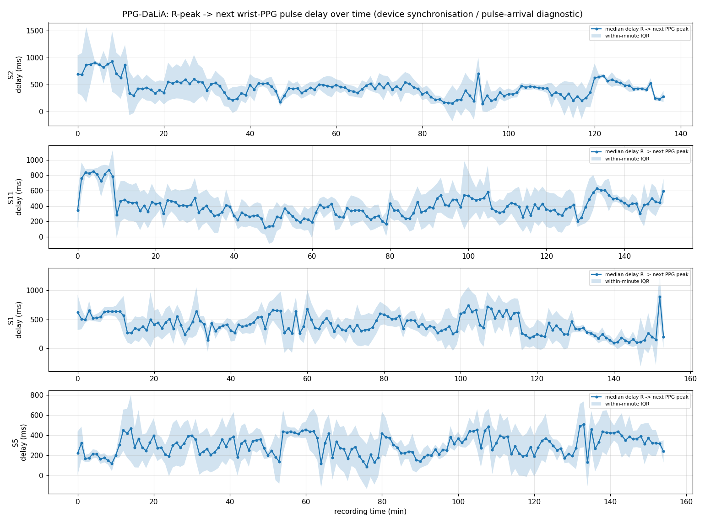
*PPG-DaLiA · R 피크 → 다음 손목 맥박 지연의 시간 추이 (기기 동기화 진단) — 초 단위 정렬까지만 보장 (A0 중 생성)* — `outputs/a0_penguin_otcfm_ppgdalia_8s_seed42/figures/dalia_sync.png` **git**

원본 폴더: `artifacts/seminar_figures` (4장)

## 1부. 재현과 one-step 질문 · A 시리즈

### A0 / A0-b — PENGUIN 베이스라인 재현

**판정** `기준선 재현`  
**데이터** PPG-DaLiA 8 s · test S2  
HR error 10.99 bpm (논문 15.64 — U1에서 프로토콜 차이 때문으로 정정). NFE 50→1이면 HR 36~39 bpm, R-peak F1 0.141→0.069로 붕괴.

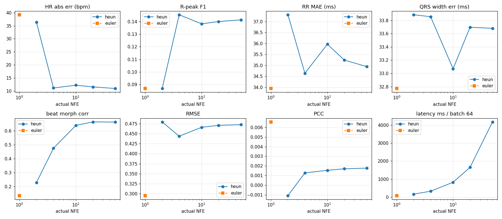
*NFE별 지표 — HR 오차 · R-peak F1 · RR MAE · QRS 폭 · 형태 상관 · RMSE · PCC · 지연시간* — `outputs/a0_penguin_otcfm_ppgdalia_8s_seed42/figures/nfe_curve.png` **git**

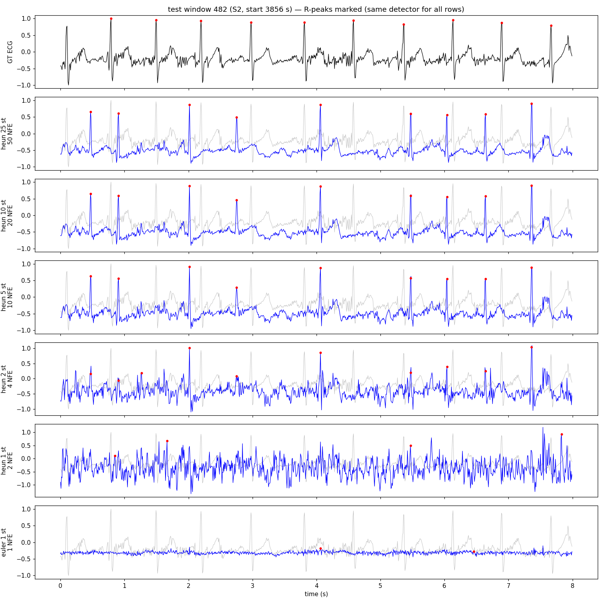
*HR 오차 분위수로 고른 창 — GT(맨 위)와 NFE별 생성 ECG* — `outputs/a0_penguin_otcfm_ppgdalia_8s_seed42/figures/example_quantile_00482.png` **git**

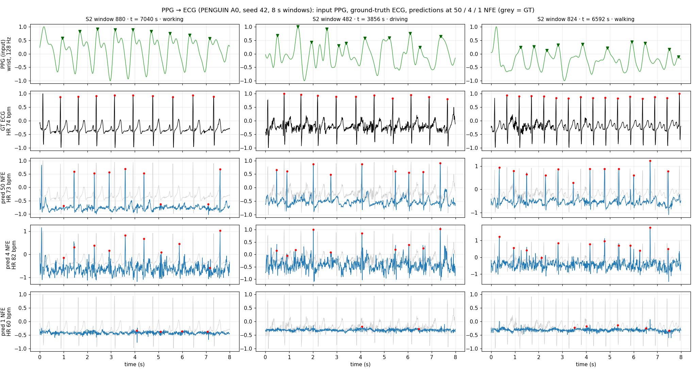
*입력 PPG(초록) · GT ECG(검정) · NFE별 예측(파랑), 창 3개* — `outputs/a0_penguin_otcfm_ppgdalia_8s_seed42/figures/ppg_pred_gt_overview.png` **git**

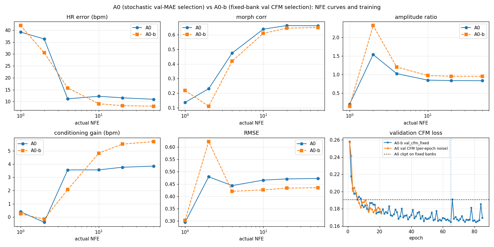
*A0 vs A0-b — NFE 곡선과 검증 손실 곡선* — `outputs/a0b_penguin_otcfm_ppgdalia_8s_seed42/figures/a0_vs_a0b.png` **git**

원본 폴더: `outputs/a0_penguin_otcfm_ppgdalia_8s_seed42/figures/` (15장) · `outputs/a0b_penguin_otcfm_ppgdalia_8s_seed42/figures/` (10장)

### A2 / A3 / A4 — OT-CFM → Improved MeanFlow (동일 백본)

**판정** `A2 SUCCESS` · `A3 SUCCESS` · `A4 PARTIAL`  
**데이터** PPG-DaLiA S2 (A2) · S1 (A3) · WildPPG test kjd/ssx (A4)  
4,568,707 params 백본은 그대로, 목적함수만 교체. NFE 1 회복: DaLiA 4/4, WildPPG 3/4 — 회복되는 축은 파형 구조이지 이벤트 신뢰도가 아님.

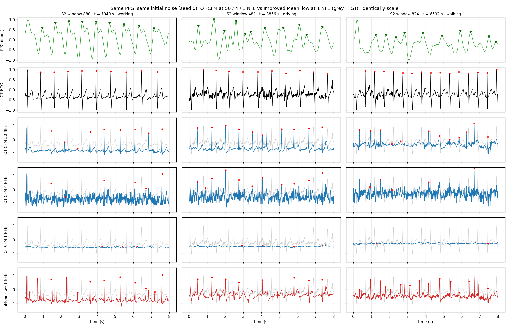
*A2 · 같은 PPG, 같은 초기 노이즈, 동일 y축에서 OT-CFM과 iMF 비교* — `outputs/a2_imeanflow_s5_ppgdalia_8s_seed42/figures/controlled_examples_quantile.png` **git**

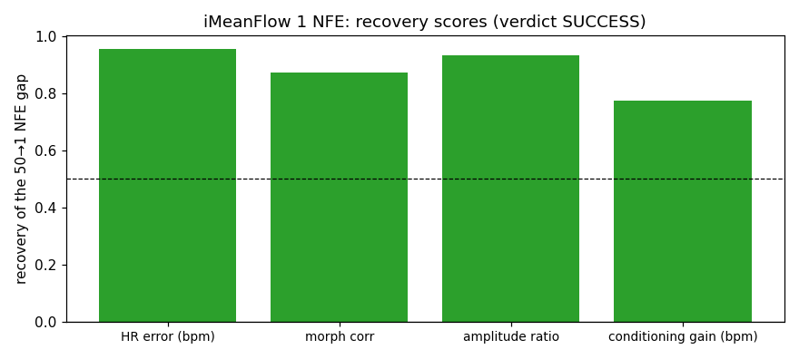
*A2 · iMF NFE 1 회복 점수 (NFE 50↔1 격차 대비) — 4개 지표 모두 0.5 초과* — `outputs/a2_imeanflow_s5_ppgdalia_8s_seed42/figures/recovery.png` **git**

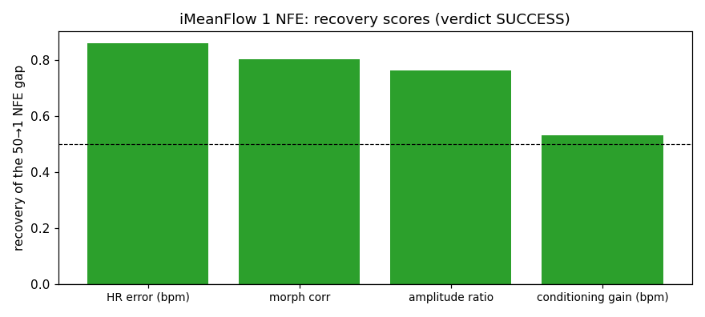
*A3 · test S1 회복 점수 — 4/4 통과* — `outputs/a3_imeanflow_ppgdalia_testS1_seed42/figures/recovery.png` **git**

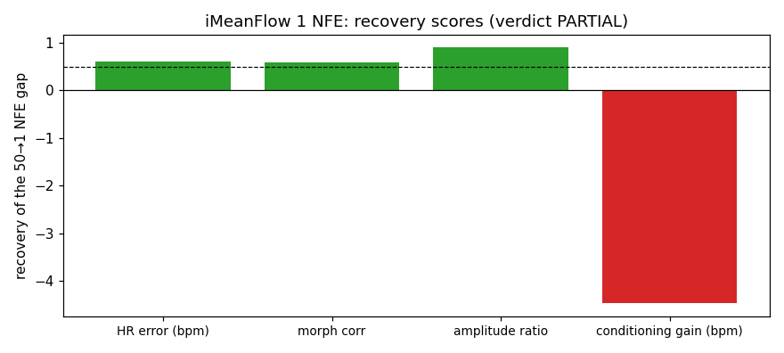
*A4 · WildPPG 회복 점수 — conditioning gain만 크게 음수 (3/4)* — `outputs/a4_imeanflow_wildppg_seed42/figures/recovery.png` **git**

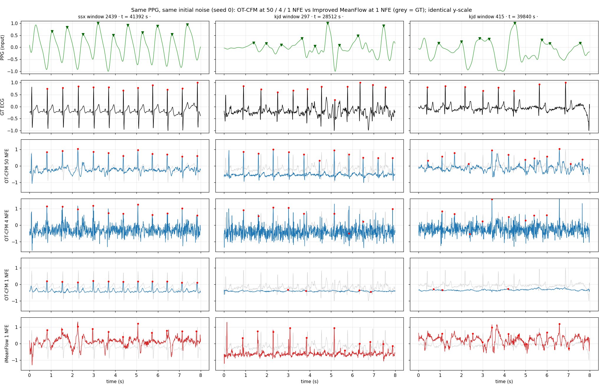
*A4 · WildPPG 통제 비교 예시* — `outputs/a4_imeanflow_wildppg_seed42/figures/controlled_examples_quantile.png` **git**

원본 폴더: `outputs/a2_imeanflow_s5_ppgdalia_8s_seed42/figures/` (4장) · `outputs/a3_imeanflow_ppgdalia_testS1_seed42/figures/` (3장) · `outputs/a3_otcfm_ppgdalia_testS1_seed42/figures/` (9장) · `outputs/a4_imeanflow_wildppg_seed42/figures/` (3장) · `outputs/a4_otcfm_wildppg_seed42/figures/` (9장)

### A5 / A6 — 조건부 평균 대조

**판정** `A5 STRONG SUPPORT` · `A6 CAPACITY OBJECTION RESOLVED`  
**데이터** a = DaLiA S2 · b = DaLiA S1 · c = WildPPG test (kjd, ssx)  
같은 백본에 순수 MSE 회귀기를 학습 — OT-CFM 1-NFE는 회귀기의 거동에 수렴. A6에서 용량 차이가 원인이 아님을 확인.

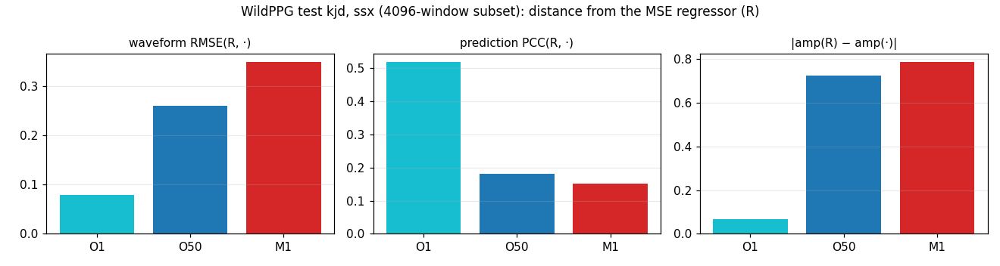
*A5c · MSE 회귀기 R과의 거리 — OT-CFM 1-NFE가 R에 가장 가깝고 OT-50 · iMF-1은 멂* — `artifacts/a5_conditional_mean_control/figures/a5c_similarity.png` **git**

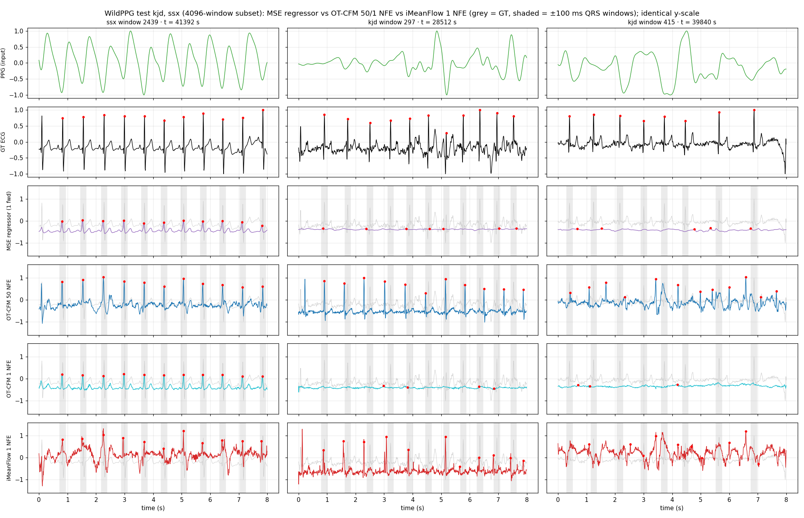
*A5c · 분위수 창 — MSE 회귀기(R) vs OT-CFM NFE 50/1 vs iMF NFE 1, 동일 y축* — `artifacts/a5_conditional_mean_control/figures/a5c_examples_quantile.png` **git**

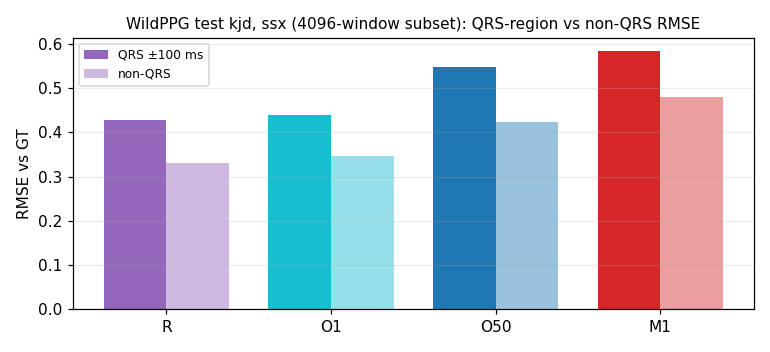
*A5c · QRS ±100 ms 구간 vs 비-QRS 구간 RMSE (R · OT-1 · OT-50 · iMF-1)* — `artifacts/a5_conditional_mean_control/figures/a5c_qrs_region.png` **git**

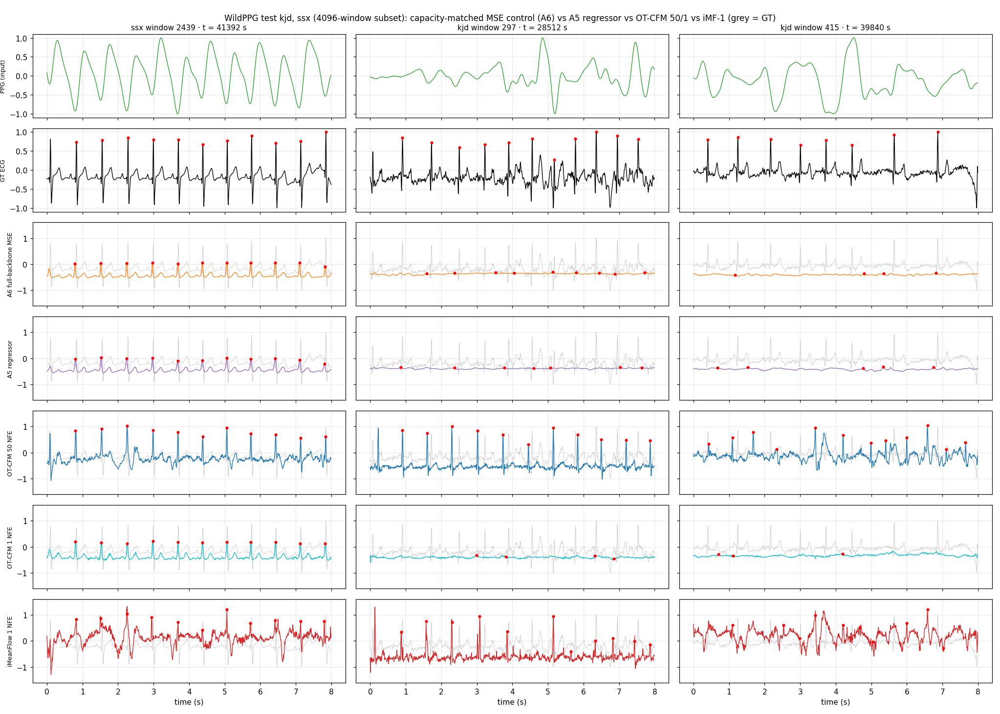
*A6c · 행: PPG / GT / Rfull / Rsmall / OT-50 / OT-1 / iMF-1 — 용량을 맞춘 회귀기도 같은 거동* — `artifacts/a6_capacity_control/figures/a6c_examples.png` **git**

원본 폴더: `artifacts/a5_conditional_mean_control/figures` (15장) · `artifacts/a6_capacity_control/figures` (6장)

### A7 / A8 / A9 — 다른 타깃으로의 일반화

**판정** `A7 NOT GENERALIZED` · `A8 SCALE SENSITIVITY CONFIRMED` · `A9 REPRESENTATION-ROBUST`  
**데이터** MIMIC-BP (ABP) · WildPPG test (global-z ECG)  
ABP는 PPG로 거의 결정돼 조건부 평균이 곧 정답. iMF의 ABP 붕괴는 원시 mmHg 스케일 탓 — 전역 affine 하나로 pulse-template 상관 0.140→0.876, RMSE 32.3→18.2 mmHg.

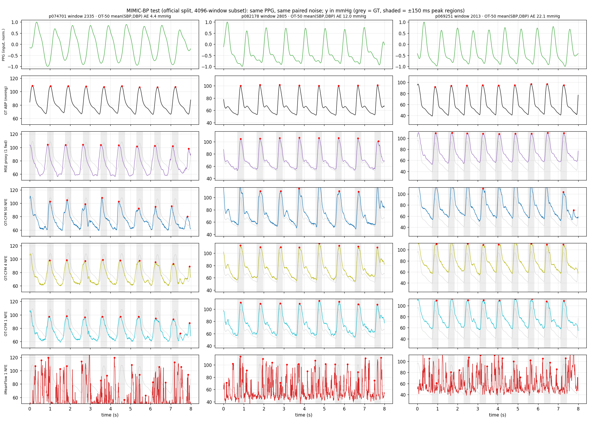
*A7 · OT-50 평균 SBP/DBP 오차의 10/50/90% 분위 창 (y축 mmHg)* — `artifacts/a7_abp_generalization/figures/a7_examples.png` **git**

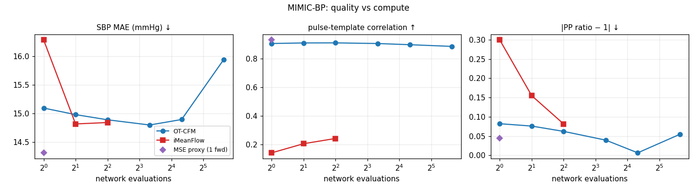
*A7 · MIMIC-BP 품질 vs 계산량(NFE) — OT-CFM · iMF · MSE 회귀기* — `artifacts/a7_abp_generalization/figures/a7_pareto.png` **git**

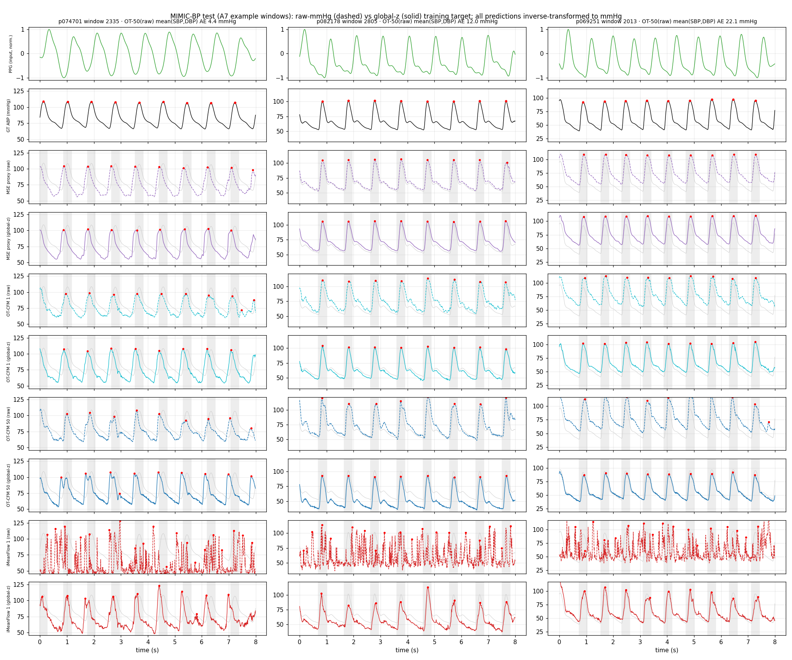
*A8 · 원시 mmHg 학습 vs 정규화 학습 출력* — `artifacts/a8_abp_scale_control/figures/a8_examples_raw_vs_norm.png` **git**

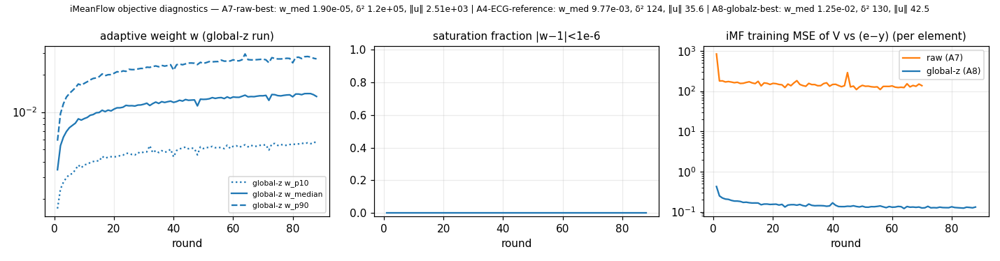
*A8 · iMF 적응 가중치 진단 — 가중치 · 포화 비율 · 학습 MSE* — `artifacts/a8_abp_scale_control/figures/a8_adaptive_weight.png` **git**

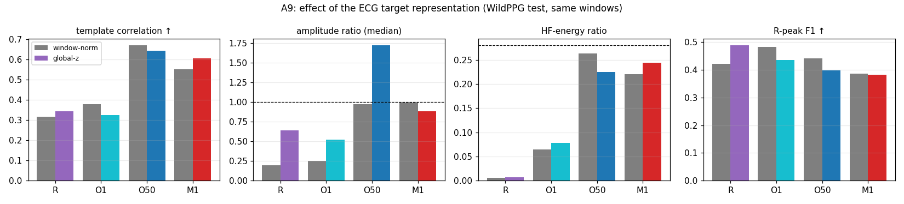
*A9 · ECG 타깃 표현(창 단위 vs 전역)의 효과 — 템플릿 상관 · 진폭 · HR 에너지 · F1* — `artifacts/a9_ecg_representation_control/figures/a9_representation_effect.png` **git**

원본 폴더: `artifacts/a7_abp_generalization/figures` (3장) · `artifacts/a8_abp_scale_control/figures` (3장) · `artifacts/a9_ecg_representation_control/figures` (2장)

## 2부. one-step에서 무엇이 깨지는가 · X 시리즈, S1

### X0 — one-step 실패 분해

**판정** `EVENT-DOMINANT`  
**데이터** WildPPG test (kjd, ssx) 3,907창 · DaLiA S1·S2  
이동이 아니라 파괴 — GT 비트마다 ±150 ms 최적 정렬을 허용해도 OT-CFM-1은 진폭 16%, QRS 에너지 3%만 남음. 타이밍은 멀쩡 (matched-peak MAE 19~20 ms).

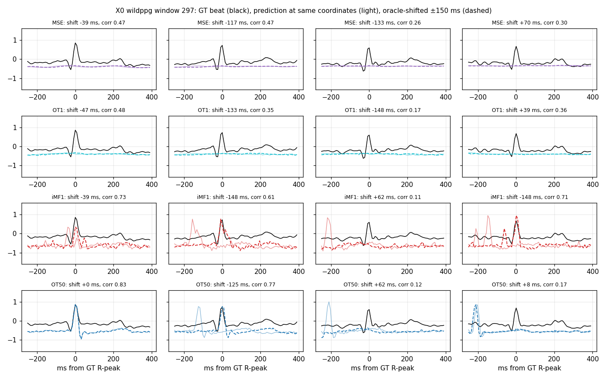
*GT(검정) · 제자리 예측(연한 선) · ±150 ms oracle 이동(점선), 비트 단위* — `artifacts/x0_error_decomposition/figures/x0_wildppg_beats_oracle_local.png` **git**

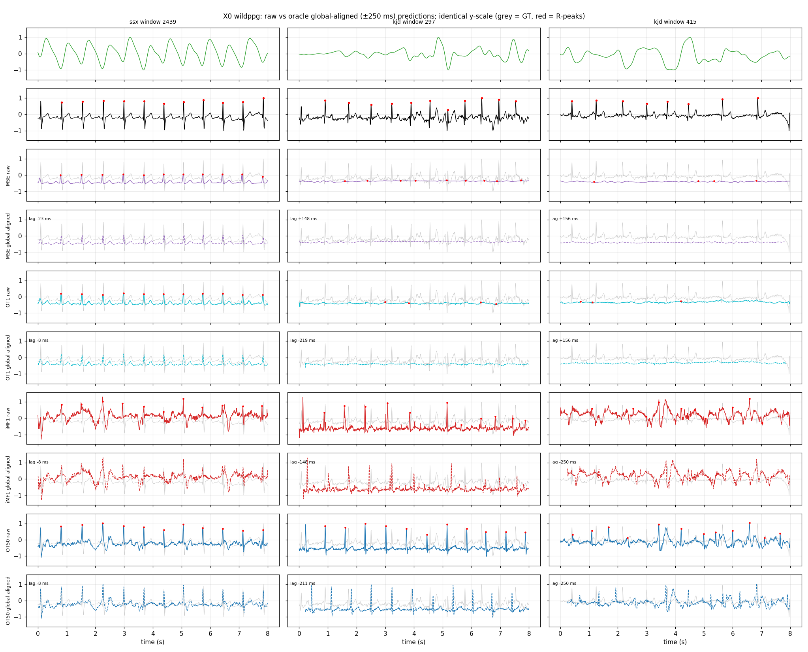
*창 예시 — raw vs global 스케일* — `artifacts/x0_error_decomposition/figures/x0_wildppg_windows_raw_vs_global.png` **git**

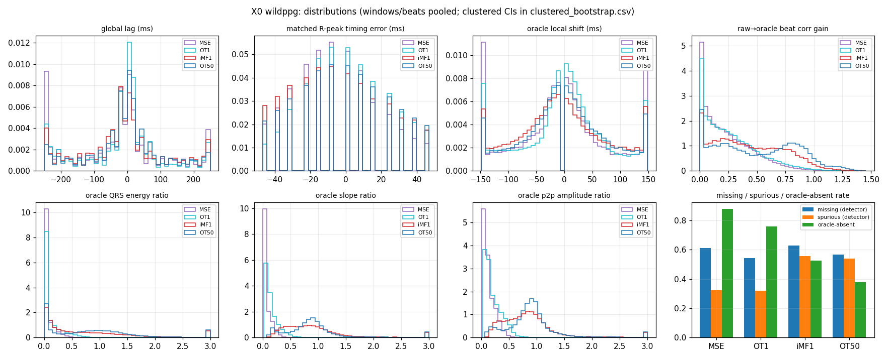
*전역 lag · 매칭 피크 타이밍 오차 · oracle 국소 이동 등의 분포* — `artifacts/x0_error_decomposition/figures/x0_wildppg_distributions.png` **git**

원본 폴더: `artifacts/x0_error_decomposition/figures` (9장)

### X2 — 엔드포인트 barycenter 항등식

**판정** `PARTIAL SUPPORT`  
**데이터** WildPPG test (kjd, ssx) · DaLiA S1·S2  
소스 소거 99.9%, 야코비안 ≈ −I로 붕괴는 확인. 단 F̄ ≠ E[x₁|c] (WildPPG PCC 0.545)라 '수렴 증명'은 금지.

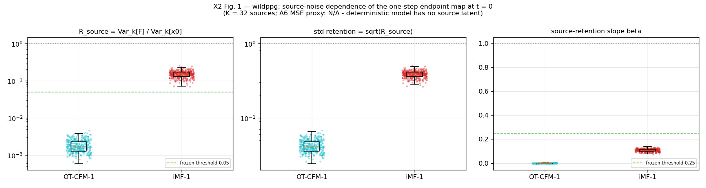
*엔드포인트의 소스 노이즈 의존도 — OT-CFM-1은 소스를 거의 소거, iMF-1은 유지* — `artifacts/x2_endpoint_identity/figures/x2_fig1_source_cancellation_wildppg.png` **git**

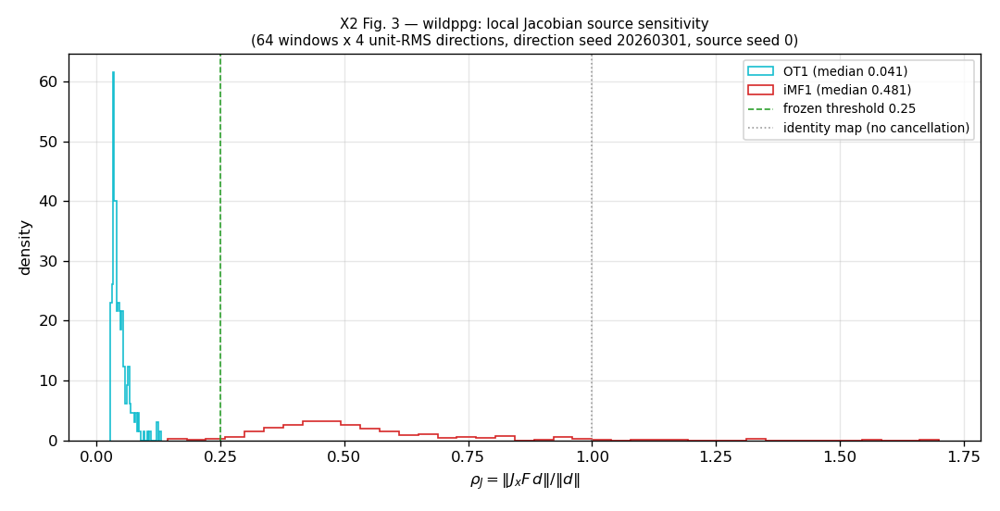
*국소 야코비안 소스 민감도 분포 — OT-CFM-1은 0 근처, iMF-1은 넓게 퍼짐 (임계 0.25)* — `artifacts/x2_endpoint_identity/figures/x2_fig3_jacobian_wildppg.png` **git**

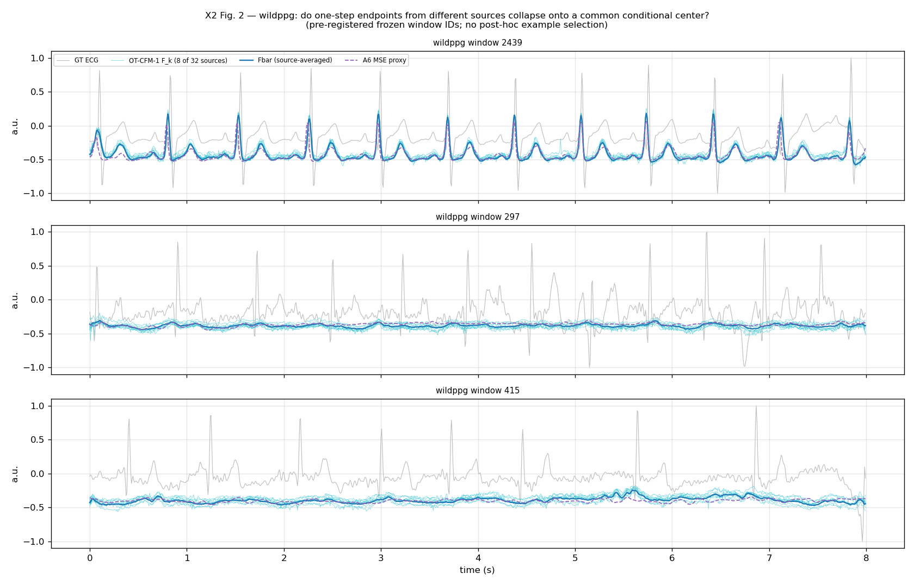
*서로 다른 소스의 1-step 엔드포인트가 하나의 조건부 중심으로 모이는가 (창 3개)* — `artifacts/x2_endpoint_identity/figures/x2_fig2_traces_wildppg.png` **git**

원본 폴더: `artifacts/x2_endpoint_identity/figures` (12장)

### X3-G0 — 커플링 비용-기하

**판정** `INCONCLUSIVE`  
**데이터** WildPPG train+val 14명  
raw L2가 QRS 대역 의존성을 이미 최대화하고, 스펙트럼 재가중은 예산을 QRS에서 빼감.

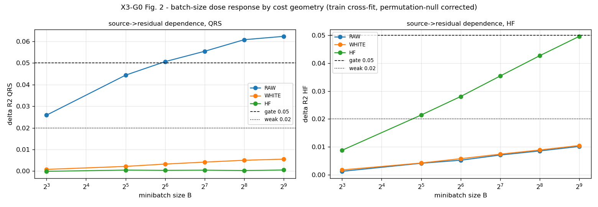
*미니배치 크기별 dose–response — 비용 기하 RAW · WHITE · HF* — `artifacts/x3_g0_coupling_geometry/figures/x3g0_fig2_dose_response.png` **git**

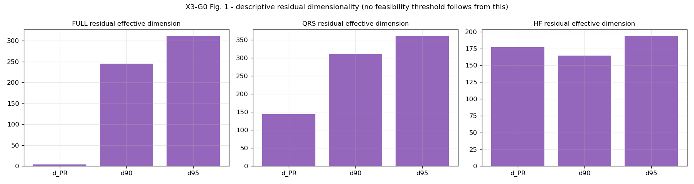
*잔차 유효 차원 (기술 통계, 판정 임계 없음)* — `artifacts/x3_g0_coupling_geometry/figures/x3g0_fig1_residual_dimension.png` **git**

원본 폴더: `artifacts/x3_g0_coupling_geometry/figures` (4장)

### X4-0 — 이벤트 신뢰도 · 소스 민감도

**판정** `FEW-STEP SATURATION + PERSISTENT SOURCE SENSITIVITY`  
**데이터** WildPPG  
NFE 4~8에서 포화. PPG를 고정하고 소스만 바꿔도 seed-pair F1 0.30, 비트 수 SD 1.2~1.8, 타이밍 SD ≈ 50 ms.

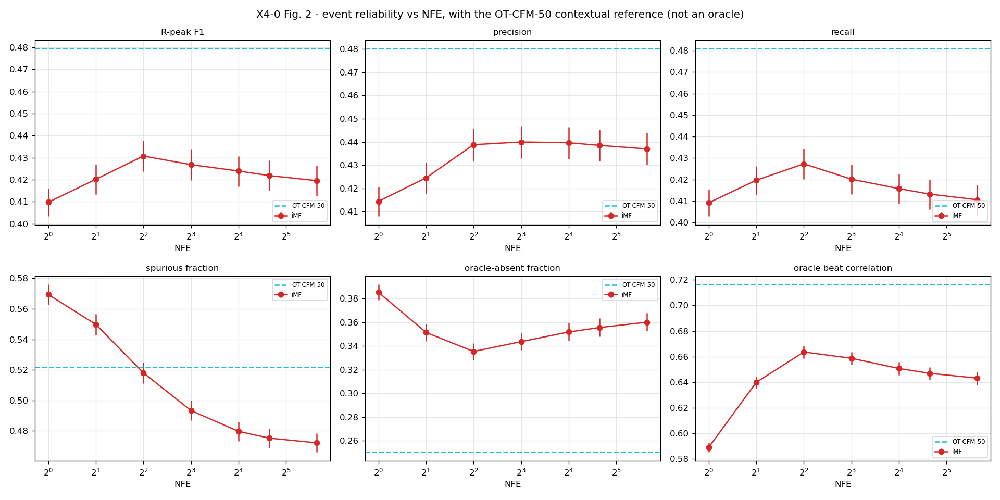
*NFE별 이벤트 신뢰도 — F1 · precision · recall · 허위 비율 등, GT-CFM 50 참조선* — `artifacts/x4_0_event_reliability/figures/fig2_event_vs_nfe.png` **git**

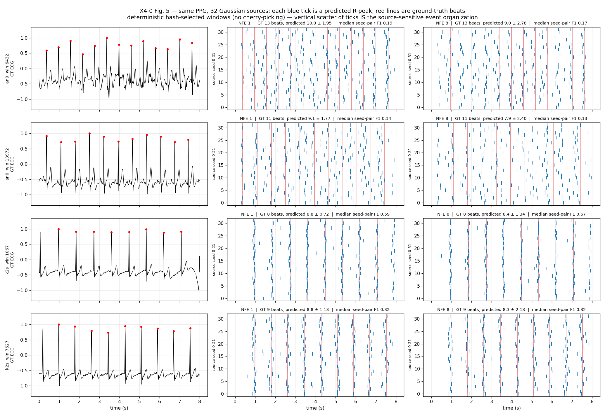
*PPG 고정, 소스 노이즈만 바꿨을 때 검출된 R 피크 래스터* — `artifacts/x4_0_event_reliability/figures/fig5_source_peak_raster.png` **git**

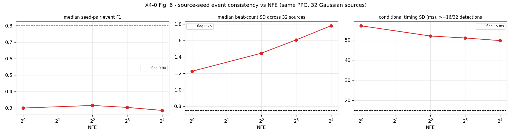
*소스 시드 간 일관성 vs NFE — seed-pair F1 · 비트 수 SD · 타이밍 SD* — `artifacts/x4_0_event_reliability/figures/fig6_source_consistency.png` **git**

*사전 시각 감사 · 같은 창의 NFE 스윕* — `artifacts/nfe_visualization/fig2_nfe_sweep.png`

*사전 시각 감사 · 샘플링 궤적* — `artifacts/nfe_visualization/fig3_trajectory.png`

원본 폴더: `artifacts/x4_0_event_reliability/figures` (9장) · `artifacts/nfe_visualization` (8장)

### S1 — 지표 타당성 감사

**판정** `G1 PASS`  
**데이터** WildPPG  
정확한 GT 위치에 QRS 템플릿을 찍으면 macro F1 0.9993. raw F1의 1/4은 우연, 검출기가 현실적 형태에서 ~0.14 F1 손실.

*G1 · GT R 위치에 QRS 템플릿 스탬핑 (행: GT ECG와 스탬핑 변형들)* — `artifacts/s1_metric_validity/figures/g1_stamping_examples.png`

*G1 · 스탬핑 신호의 F1 분포 — T-B@50 ms = 0.9993 → PASS* — `artifacts/s1_metric_validity/figures/g1_f1_distributions.png`

*oracle-shift 이득 vs 비매칭 비트 null — 방법마다 두 막대가 거의 같음* — `artifacts/s1_metric_validity/figures/oracle_true_vs_null.png`

*놓친 GT 비트 분해 — DISPLACED(50~150 ms) · WEAK · ABSENT, 방법별* — `artifacts/s1_metric_validity/figures/event_failure_decomposition.png`

원본 폴더: `artifacts/s1_metric_validity/figures` (7장)

## 3부. 압축과 구간 노출 · C 시리즈, M1

### C0 — iMF 압축 타깃

**판정** `NFE 4 확정`  
**데이터** WildPPG  
NFE 4를 압축 타깃으로 확정 (압축 방법은 미선택).

*iMF NFE 1·2·4·8의 이벤트 F1(우연 대비) vs QRS 에너지 비* — `artifacts/c0_imf_compression_target/figures/c0_nfe_event_vs_structure.png`

*인접 NFE 쌍의 paired bootstrap 개선 (피험자 층화, 2,000회)* — `artifacts/c0_imf_compression_target/figures/c0_paired_improvement.png`

원본 폴더: `artifacts/c0_imf_compression_target/figures` (3장)

### C1 — 구간 노출 대조

**판정** `TARGET h=0.5 EXPOSURE SUPPORTED`  
**데이터** WildPPG  
학습 시 h=0.5 구간 노출이 few-step 성능 격차를 줄임.

*학습 중 구간 h 노출 분포 (arm별)* — `artifacts/c1_interval_exposure/figures/c1_sampler_exposure.png`

*arm 간 paired bootstrap 효과 @NFE 2* — `artifacts/c1_interval_exposure/figures/c1_paired_effects.png`

*NFE 2 격차 해소율 — 1이면 NFE 2가 기준선의 NFE 4 값에 도달* — `artifacts/c1_interval_exposure/figures/c1_nfe2_gap_closure.png`

원본 폴더: `artifacts/c1_interval_exposure/figures` (4장)

### M1 — C1 구조 메커니즘 감사

**판정** `CALIBRATION-ONLY`  
**데이터** WildPPG  
C1의 이득은 진폭/에너지 보정이지 구조 개선이 아님 — 제안된 메커니즘 기각.

*구간별(QRS core · peri-QRS · 배경) 제곱오차와 국소화 대비 @NFE 2* — `artifacts/m1_c1_structural_audit/figures/m1_qrs_vs_background_improvement.png`

*주파수 대역별 재구성 오차 에너지와 예측/GT 에너지 비 @NFE 2* — `artifacts/m1_c1_structural_audit/figures/m1_frequency_error_decomposition.png`

*an0 · 손목 창 모음* — `artifacts/m1_c1_structural_audit/visual_atlas/contact_an0_wrist.png`

원본 폴더: `artifacts/m1_c1_structural_audit` (16장)

### C2 — 압축 본실험

**판정** `영구 보류`  
**데이터** —  
15-run · 54 GPU-h 사전등록만 하고 학습하지 않음.

_그림 없음 — 결과는 리포트의 표와 JSON에만 있습니다._

## 4부. PPG에서 무엇이 관측 가능한가 · V1, R, O, E, Q1

### V1 — PPG 피크 → ECG R 지연

**판정** `상수 지연으로 R 위치 불가`  
**데이터** WildPPG dev 피험자 · 4부위  
지연 IQR 227 ms, 피험자 내 분산 지배, 50 ms 커버리지 0.22.

*피험자별 R→PPG 피크 지연 (PTT 아님: 전기기계 지연·상승 시간 포함)* — `artifacts/v1_stepwise_visualization/figures/all_subject_r_ppg_delay.png`

*피험자 × 부위 지연 IQR (ms)* — `artifacts/v1_stepwise_visualization/figures/subject_site_delay_iqr_heatmap.png`

*train 피험자로 만든 PPG→R 타이밍 prior의 커버리지 (an0/k2s 검증, ≤25/50/100/150 ms)* — `artifacts/v1_stepwise_visualization/figures/timing_prior_coverage.png`

*an0 · 손목 창 1005 — PPG · GT ECG · NFE별 생성 (같은 소스 시드)* — `artifacts/v1_stepwise_visualization/figures/an0_wrist_w1005.png`

원본 폴더: `artifacts/v1_stepwise_visualization/figures` (459장) · `artifacts/v1_stepwise_visualization/beat_zooms` (448장) · `artifacts/v1_stepwise_visualization/dashboard/index.html`

### R1 — PPG-only 리듬 추출기

**판정** `정밀 타이밍 제한` · `전역 리듬 지지`  
**데이터** WildPPG · Global/Local-TCN 328,897 params  
F1@50 ms = 0.62 (잔차 50~150 ms), RR 오차 15.6 ms.

*an0/k2s 매칭 허용오차별 F1 — global · local · 셔플 대조* — `artifacts/r1_global_rhythm/figures/f1_vs_tolerance.png`

*Global-TCN RR vs GT RR (n = 58,770, 상관 0.891)* — `artifacts/r1_global_rhythm/figures/rr_scatter_global.png`

*부위별 Global-TCN F1과 RR MAE* — `artifacts/r1_global_rhythm/figures/site_coarse_f1.png`

*an0 · 손목 시각 아틀라스* — `artifacts/r1_global_rhythm/visual_atlas/an0_wrist.png`

*an0 · 손목 대조 조건 아틀라스* — `artifacts/r1_global_rhythm/visual_atlas/controls_an0_wrist.png`

원본 폴더: `artifacts/r1_global_rhythm` (20장)

### R2 — 가산 어댑터로 scaffold 주입

**판정** `SCAFFOLD INFORMATIVE, MINIMAL INTERFACE INSUFFICIENT`  
**데이터** WildPPG  
이벤트 +0.0194 (임계 미달), QRS 구조 악화.

*an0 · 손목 창 1005 — PPG · TRUE scaffold · GT ECG · arm별 생성 (NFE 4)* — `artifacts/r2_rhythm_transfer/visual_atlas/an0_wrist_w1005.png`

![같은 창, GT R 중심 [−300, +500] ms — B · TRUE · SHUFFLE · ORACLE (GT-R leakage; diagnostic only)](../artifacts/r2_rhythm_transfer/visual_atlas/an0_wrist_w1005_zoom.png)
*같은 창, GT R 중심 [−300, +500] ms — B · TRUE · SHUFFLE · ORACLE (GT-R leakage; diagnostic only)* — `artifacts/r2_rhythm_transfer/visual_atlas/an0_wrist_w1005_zoom.png`

원본 폴더: `artifacts/r2_rhythm_transfer/visual_atlas` (128장)

### R3 — cross-attention + gate

**판정** `EVENT GAIN WITH STRUCTURE TRADE-OFF PERSISTS`  
**데이터** WildPPG  
이벤트 +0.0406, 그러나 구조 비용은 최악.

*an0 · 손목 창 1005 (R2와 같은 창) — arm별 생성 (NFE 4)* — `artifacts/r3_rhythm_fusion/visual_atlas/an0_wrist_w1005.png`

*같은 창 확대 — B · ADD · TF-TRUE · GTF-TRUE · GTF-CONST · GTF-ORACLE (GT-R leakage; diagnostic only)* — `artifacts/r3_rhythm_fusion/visual_atlas/an0_wrist_w1005_zoom.png`

원본 폴더: `artifacts/r3_rhythm_fusion/visual_atlas` (128장)

### O1 — ECG 성분 추출 가능성

**판정** `COMPONENT-WISE EXTRACTABILITY HETEROGENEITY SUPPORTED`  
**데이터** WildPPG  
ECG 성분마다 PPG에서 추출 가능한 정도가 다름.

*성분별 PPG 추출 가능성(x) × 생성기 활용도(y) — 사분면 분류* — `artifacts/o1_component_extractability/figures/fig5_extractability_utilization.png`

*성분(T1~T9) × arm 정규화 MAE (an0+k2s 검증)* — `artifacts/o1_component_extractability/figures/fig1_component_arm_nmae.png`

원본 폴더: `artifacts/o1_component_extractability/figures` (6장)

### O2 — oracle 이벤트 정준화

**판정** `REJECTED`  
**데이터** WildPPG  
왕복 오차가 격자 오프셋에 따라 임계 0.020을 넘음.

*격자 오프셋별 왕복 형태 오차 — 원인은 분수 오프셋 보간 (임계 0.020)* — `artifacts/o2_oracle_canonicalization/figures/fig1_roundtrip_vs_grid_offset.png`

*최악 창 — 분수 오프셋 bilinear 재표본화가 QRS 피크·기울기·곡률을 뭉갬* — `artifacts/o2_oracle_canonicalization/figures/fig2_qrs_blunting_example.png`

원본 폴더: `artifacts/o2_oracle_canonicalization/figures` (2장)

### O2b — 정수 격자 정준화

**판정** `ACCEPTED`  
**데이터** WildPPG  
정수 격자로 바꾸자 왕복 오차 문제 해소.

*왕복 형태 오차: O2 분수 오프셋 vs O2b 정수 격자 (로그축, 임계 0.020)* — `artifacts/o2b_integer_grid/figures/fig1_o2_vs_o2b_nae.png`

*O2의 최악 창을 O2b로 왕복 — 정수 격자는 QRS를 그대로 복원* — `artifacts/o2b_integer_grid/figures/fig4_worst_case_window.png`

원본 폴더: `artifacts/o2b_integer_grid/figures` (4장)

### O2c — oracle 정수 격자 MeanFlow

**판정** `ORACLE EVENT-CANONICALIZATION JOINTLY SUPPORTED`  
**데이터** WildPPG  
oracle 좌표를 주면 상관 0.104→0.841, QRS-core 미분 RMSE 0.322→0.133.

*O2c vs B 사전등록 주요 대비 (GT-R leakage; diagnostic only)* — `artifacts/o2c_oracle_integer_grid/figures/primary_contrasts_forest.png`

*R 중심 비트 오버레이 (평균 ± 밴드)* — `artifacts/o2c_oracle_integer_grid/figures/r_centred_overlays.png`

*k2s · 손목 창 예시* — `artifacts/o2c_oracle_integer_grid/figures/atlas/v1_58_k2s_wrist_16288.png`

원본 폴더: `artifacts/o2c_oracle_integer_grid/figures` (66장)

### O3 — 스케줄 오차 허용범위

**판정** `TOLERANCE REGION TOO NARROW`  
**데이터** WildPPG  
oracle로 학습한 정준 생성기는 ±15.6 ms 지터만 견딤 — R1이 주는 50~150 ms와 양립 불가.

*공급 스케줄 오차별 생성기 지표 — 허용 영역* — `artifacts/o3_schedule_tolerance/figures/fig6_tolerance_region.png`

*공급 스케줄 타이밍 MAE vs 생성기 F1 excess — 지터 수준별, ★ = R1 스케줄 (GT-R leakage; diagnostic only)* — `artifacts/o3_schedule_tolerance/figures/fig1_timing_vs_f1_excess.png`

*부위별 동결 R1 스케줄 연결 (2차 분석, 부위 인과 주장 없음)* — `artifacts/o3_schedule_tolerance/figures/fig7_site_r1_bridge.png`

원본 폴더: `artifacts/o3_schedule_tolerance/figures` (7장)

### E1 — 이벤트 배치 · 형태 분해

**판정** `MIXED TOPOLOGY AND PLACEMENT LIMITATION`  
**데이터** WildPPG  
비트 1개 누락/추가가 62.5 ms 지터보다 형태를 8.7배 더 망침.

*자기 중심 형태 손상 — 강한 지터(JITTER_8) vs 비트 1개 누락(MISS1)·추가(EXTRA1)* — `artifacts/e1_event_morphology_decomposition/figures/fig3_topology_vs_timing.png`

*지터에 따른 GT 기준 국소 미분 오차 vs 자기 중심 T6 오차* — `artifacts/e1_event_morphology_decomposition/figures/fig1_decomposition_derivative.png`

원본 폴더: `artifacts/e1_event_morphology_decomposition/figures` (7장)

### E2 — 평가 계약

**판정** `CONTRACT ACCEPTED`  
**데이터** WildPPG  
이벤트 집합 · 배치 · 형태를 나눠 재는 평가 계약 수립.

*동결된 이벤트-기하 평가 계약 — 집합 · 배치 · 자기 중심 형태와 결합 축* — `artifacts/e2_evaluation_contract/figures/fig1_four_axis_schematic.png`

*배치 손상은 스케줄·GT 기준 축에서만 보이고 자기 중심 형태에선 안 보임* — `artifacts/e2_evaluation_contract/figures/fig2_oracle_vs_jitter8.png`

원본 폴더: `artifacts/e2_evaluation_contract/figures` (4장)

### E3 — 비트 집합 우선

**판정** `COUNT-ONLY CEILING NOT SUPPORTED`  
**데이터** WildPPG  
비트 수만 맞추는 상한 가설은 지지되지 않음.

*정확한 비트 수를 줘도 집합은 정확해지지 않음 (R1-0.35 vs ORACLE-COUNT-R1)* — `artifacts/e3_beat_set_first/figures/fig1_event_set.png`

*비트 수 제약이 강제하는 누락 vs 허위 trade-off* — `artifacts/e3_beat_set_first/figures/fig2_missing_vs_spurious.png`

원본 폴더: `artifacts/e3_beat_set_first/figures` (3장)

### Q1 — 조건부 support 저하

**판정** `NO CONSISTENT CONDITION-DEGRADATION PATTERN`  
**데이터** WildPPG  
조건 저하에 따른 일관된 패턴 없음.

*an0 · 손목 창 1005 (R2/R3와 같은 창)* — `artifacts/q1_conditional_support/visual_atlas/q1_atlas_an0_wrist_1005.png`

원본 폴더: `artifacts/q1_conditional_support/visual_atlas` (64장)

## 5부. 구조 가중 목적함수 · M2, M3

### M2 — 구조 가중 손실 (GSW-iMF)

**판정** `VERDICT D`  
**데이터** WildPPG  
G1 −3.87%, G2 −14.16% — 둘 다 악화.

_그림 없음 — 결과는 리포트의 표와 JSON에만 있습니다._

### M3 — 구조적 엔드포인트 일관성 (SEC-iMF)

**판정** `VERDICT D`  
**데이터** WildPPG  
G1 +2.66% (5% 바 미달). 개선이 QRS 바깥(+26.9%)에 몰리고 core 안은 +4.85%뿐.

_그림 없음 — 결과는 리포트의 표와 JSON에만 있습니다._

## 6부. 다중 데이터셋 벤치마크 · D 시리즈

### D1 — 5개 corpus 동결 방법론

**판정** `NFE가 출력을 정답 쪽으로 옮기지 않음`  
**데이터** PPG-DaLiA · WildPPG · BIDMC · CapnoBase · VitalDB  
NFE는 출력을 0.094~0.133 움직이지만 정답 쪽이 아님. PCC는 VitalDB 외 0 근처.

*corpus별 정성 비교 격자* — `outputs/d1_bench/figures/d1_fig1_qualitative_grid.png`

*NFE trade-off (corpus별 지표)* — `outputs/d1_bench/figures/d1_fig3_nfe_tradeoff.png`

*비트 배치 실패* — `outputs/d1_bench/figures/d1_fig4_beat_failure.png`

*샘플링 예산(NFE)별 생성 ECG — corpus당 테스트 창 1개* — `outputs/d1_bench/figures/d1_fig7_stepwise_grid.png`

원본 폴더: `outputs/d1_bench/figures` (9장)

### D2 — 베이스라인 바닥

**판정** `RMSE는 반정보적`  
**데이터** D1과 같은 5개 corpus  
아무것도 안 쓰는 B3가 모든 corpus에서 최저 RMSE, HR error는 박동 수만으로 충족. DaLiA만 진짜 실패.

*corpus별 자명한 예측(B0~B5) 대비 모델의 위치* — `outputs/d2_baselines/figures/d2_fig10_baseline_floor.png`

*모델이 주어진 PPG를 쓰는가 — 같은 모델·노이즈에서 PPG만 바꿔 비교* — `outputs/d2_baselines/figures/d2_fig11_conditioning.png`

원본 폴더: `outputs/d2_baselines/figures` (2장)

### D3 — PENGUIN 6개 데이터셋 프로토콜

**판정** `논문 대비 4승 4패`  
**데이터** PPG-DaLiA · WildPPG · BIDMC · WESAD · UCI-BP · MIMIC-BP  
sample_num = duration×3600/8로 8 s가 확정되나 train.py:43의 assert가 8 s를 막는 내부 모순 발견.

*PPG-DaLiA — 타깃(검정) vs iMF 생성(빨강)* — `outputs/d3_bench/figures/d3_examples_dalia.png`

*WildPPG — 타깃 vs iMF 생성* — `outputs/d3_bench/figures/d3_examples_wildppg.png`

*BIDMC 호흡 — 타깃 vs iMF 생성* — `outputs/d3_bench/figures/d3_examples_bidmc_resp.png`

*WESAD 호흡 — 타깃 vs iMF 생성* — `outputs/d3_bench/figures/d3_examples_wesad_resp.png`

*UCI-BP 동맥압 — 타깃 vs iMF 생성* — `outputs/d3_bench/figures/d3_examples_uci_bp.png`

*MIMIC-BP 동맥압 — 타깃 vs iMF 생성* — `outputs/d3_bench/figures/d3_examples_mimicbp.png`

원본 폴더: `outputs/d3_bench/figures` (6장)

### D4 — KANFlow 프로토콜 지표표

**판정** `단조 개선 지표 없음`  
**데이터** BIDMC · CapnoBase · VitalDB  
MAE·RMSE·FD·Micro/Macro-F1·RR-MAE·MAE_HR 산출. NFE를 올려도 단조 개선되는 지표가 없음.

_그림 없음 — 결과는 리포트의 표와 JSON에만 있습니다._

## 7부. upstream 재현과 공정 비교 · U 시리즈

### U1 — upstream train.py 출하 그대로

**판정** `6 REPRODUCED · 1 PARTIAL · 1 NOT`  
**데이터** 6개 데이터셋 · segment_len 4  
UCI-BP 8명이 4명의 바이트 동일 복제(누수), WildPPG는 upstream patience가 1-epoch 모델을 선택해 실패.

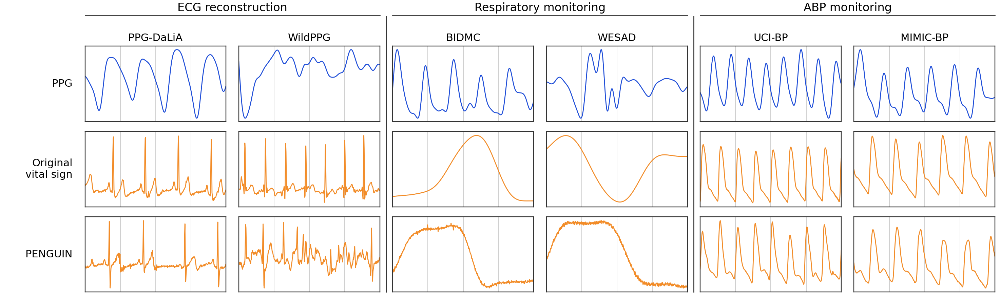
*논문 Figure 레이아웃 재현 — 행: PPG / 원 신호 / PENGUIN* — `artifacts/u1_upstream/figures/u1_paper_style_qualitative.png` **git**

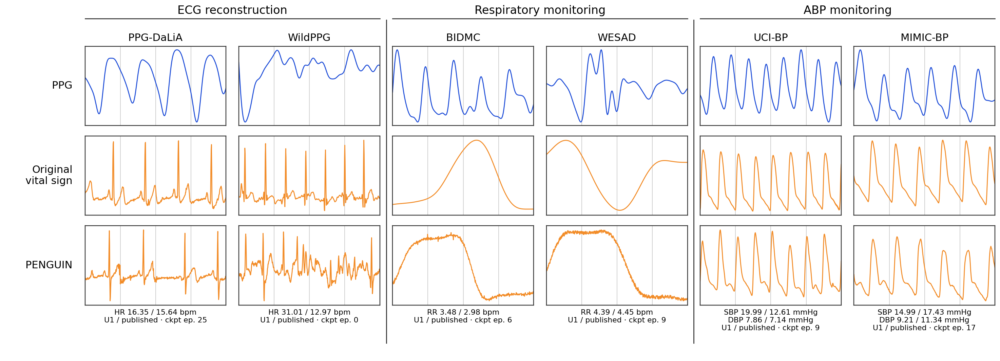
*같은 그림, 열마다 U1 지표와 논문 수치 표기* — `artifacts/u1_upstream/figures/u1_paper_style_annotated.png` **git**

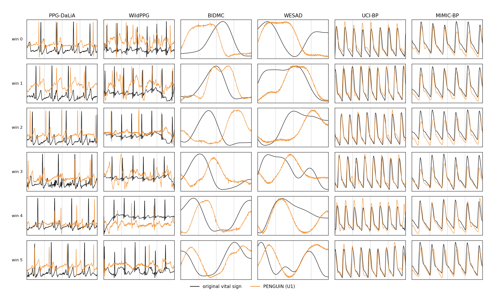
*데이터셋별 연속 테스트 창 6개 (타깃 검정 · PENGUIN 주황) — 좋은 한 장이 대표성이 없음* — `artifacts/u1_upstream/figures/u1_test_window_variability.png` **git**

원본 폴더: `artifacts/u1_upstream/figures` (3장)

### U2 — 계산량 맞춘 paired 비교 (iMF vs OT-CFM)

**판정** `PARTIAL 3/5`  
**데이터** U1의 6개 · 14,000 step × 12 run  
U3에서 결함 보정 후 NOT SUPPORTED로 정정됨.

_그림 없음 — 결과는 리포트의 표와 JSON에만 있습니다._

### U3 — gate · 선택 민감도

**판정** `NOT SUPPORTED 1/5`  
**데이터** U2 결과 재분석 (학습 0)  
단방향 gate + 동일 14k step 체크포인트면 WildPPG만 생존.

_그림 없음 — 결과는 리포트의 표와 JSON에만 있습니다._

## 8부. 자명한 베이스라인과 방향 결정 · N 시리즈

### N1 — 검출기 + 템플릿

**판정** `NULL DOMINATES`  
**데이터** WildPPG 2,048창  
학습 0의 N-R1 +0.4866 > 최고 학습 arm +0.3582. 균등 격자 N-CONST도 +0.2949.

_그림 없음 — 결과는 리포트의 표와 JSON에만 있습니다._

### N2 — oracle 타이밍에서 비트 형태

**판정** `PPG DOES NOT CARRY BEAT SHAPE`  
**데이터** WildPPG  
템플릿 +0.9062 vs 회귀기 +0.9057, PPG 기여분 +0.0039.

_그림 없음 — 결과는 리포트의 표와 JSON에만 있습니다._

### N3 — 4부위 PPG 융합

**판정** `MARGINAL`  
**데이터** WildPPG 4부위  
REG-4가 템플릿 대비 +0.0005 (바의 1/100).

_그림 없음 — 결과는 리포트의 표와 JSON에만 있습니다._

### N4 — 타이밍 분산 캘리브레이션

**판정** `CALIBRATED`  
**데이터** WildPPG  
coverage 0.587/0.833/0.902. 단 중심 −15.5 ms 조기, per-beat 정보 +0.03.

_그림 없음 — 결과는 리포트의 표와 JSON에만 있습니다._

### N5 — per-beat 불확실성 예측

**판정** `PREDICTABLE`  
**데이터** WildPPG  
sharpness Spearman +0.475, shuffle에서 +0.002로 붕괴.

_그림 없음 — 결과는 리포트의 표와 JSON에만 있습니다._

### N6 — 생성 샘플러 안의 불확실성

**판정** `DOES NOT PRESERVE · NFE 1`  
**데이터** WildPPG  
NFE 1 샘플 SD 7.1 ms (실제 잔차 SD 53.7). 사후 스윕: NFE 2에서 sharpness +0.491 회복.

_그림 없음 — 결과는 리포트의 표와 JSON에만 있습니다._

### N7 — 캘리브레이션된 marked posterior

**판정** `NOT SUPPORTED 3/12`  
**데이터** WildPPG 12명 · 4 fold × 3 seed  
sharpness +0.445 ± 0.021로 복제(유일한 복제 양성), coverage는 3/12만 통과.

_그림 없음 — 결과는 리포트의 표와 JSON에만 있습니다._
